# TaskNest

TaskNest is a Flutter-based scheduling and event management app for organizing events across members.

- 🗂️ **Three schedule views** - list, weekly columns, and month calendar
- 👥 Member filtering
- 📅 Date filtering
- ⏰ Event reminders (local notifications)
- ⚠️ Overlap detection - warns when a new event clashes with existing ones
- 🌐 Localization (English & Russian)
- 🌗 System / Light / Dark theme support
- 💾 Offline-first - events and members are stored locally

## 📱 Screenshots

  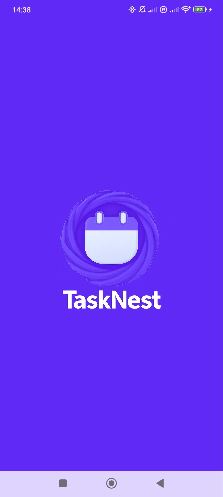

### Schedule views

TaskNest shows your schedule in three switchable views:

  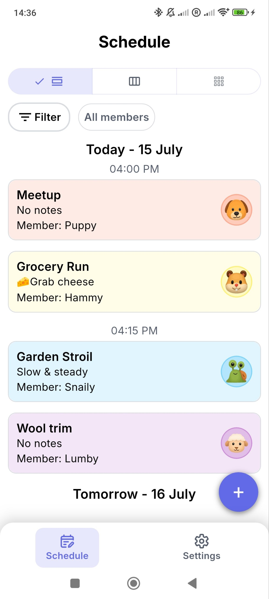
  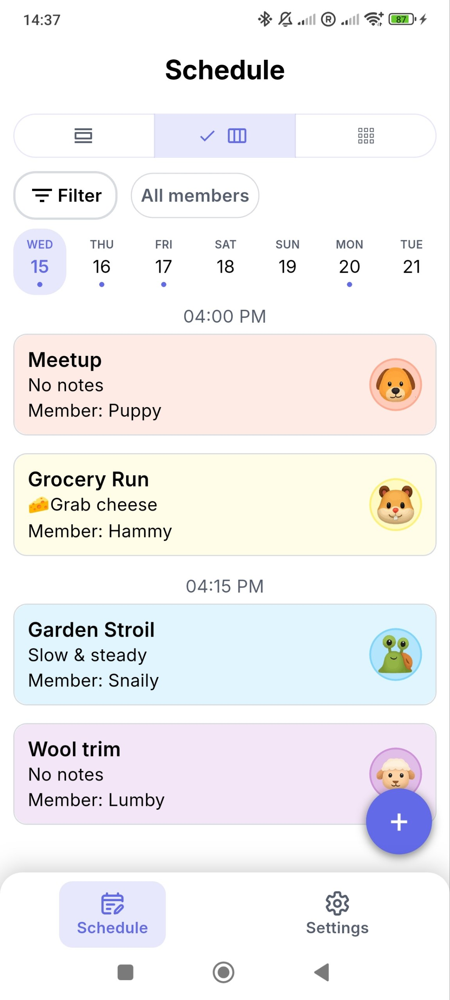
  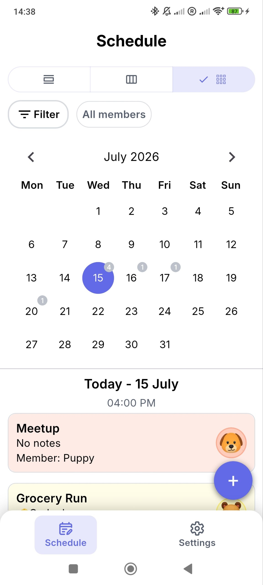

### Creating & editing events

Set reminders, and get warned about overlaps with other members' events:

  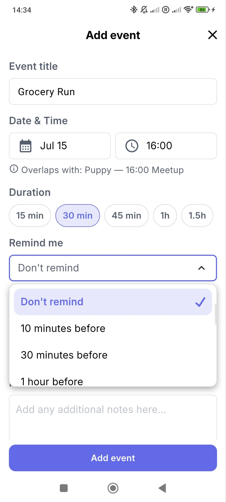
  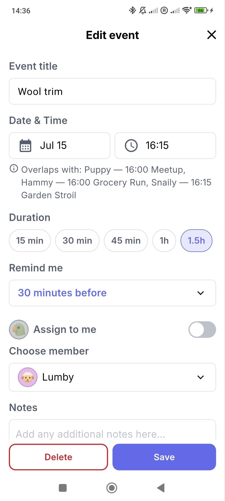

### Members & filters

  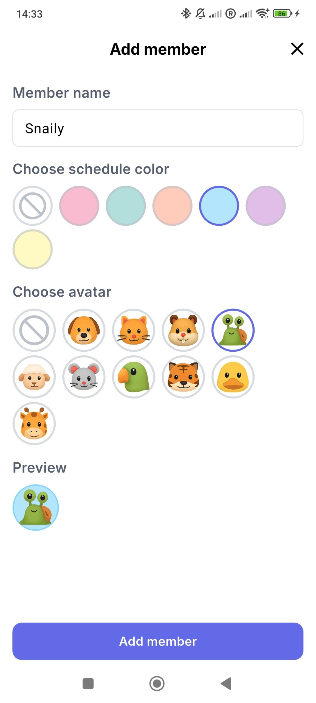
  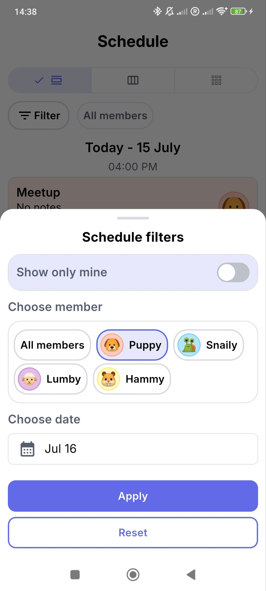

### Settings & more

  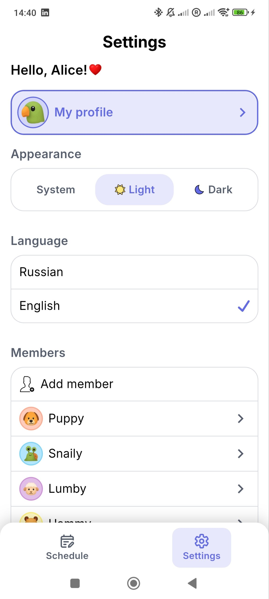
  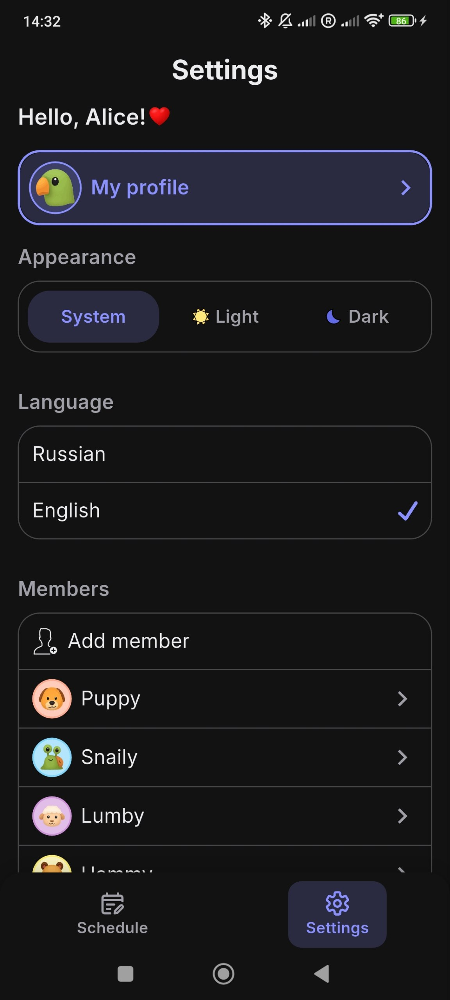
  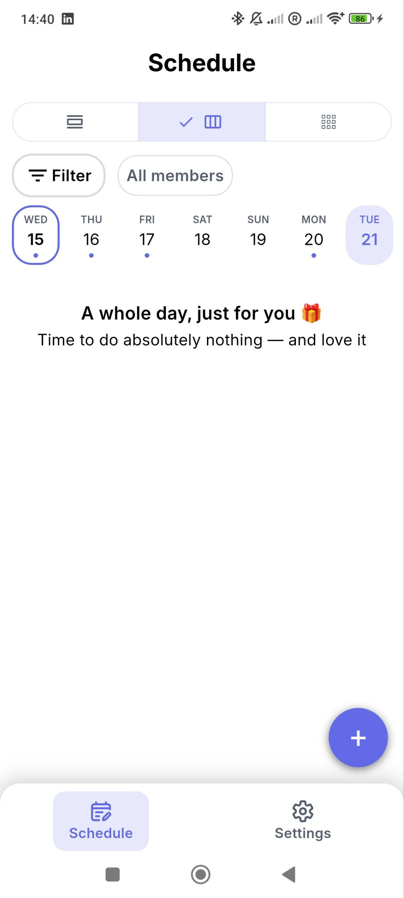

## ✨ Features

### 🗂️ Three ways to view your schedule
Switch instantly between three layouts, each suited to a different need:
- **List** - a chronological feed of upcoming events grouped by day and time.
- **Week** - seven day-columns with per-day event indicators, so you can scan a whole week at a glance.
- **Calendar** - a full month grid with a per-day event counter; tap any date to see that day's events below.

### ⏰ Push reminders
Attach a reminder to any event (10 minutes, 30 minutes, or 1 hour before) and TaskNest sends a local push notification at the right time - even when the app is closed. Reminders survive restarts and respect the device's exact-alarm and notification permissions. Each notification shows the event title, its time, and the assigned member.

  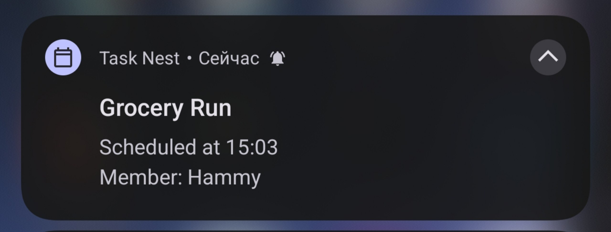

### ⚠️ Overlap detection
When you create or edit an event, TaskNest checks it against everyone else's schedule and warns you inline if it clashes - showing exactly **who** is busy and **when** (e.g. *"Overlaps with: Puppy - 16:00 Meetup"*). No more double-booking members.

### 👥 Members & filtering
- Add members with a custom avatar and color.
- Assign each event to a member (or to yourself).
- Filter the schedule by a specific member, by date, or show only your own events.

### 🎨 Personalization
- **System / Light / Dark** theme support.
- Fully **localized UI** in English and Russian.

### 💾 Offline-first
All events and members are stored locally, so the app works with no network connection.

## 🏗️ Architecture

- **State management:** BLoC (Cubit-based)
- **Local database:** Drift
- **Localization:** easy_localization
- Clean architecture with a clear separation of data / domain / presentation layers
