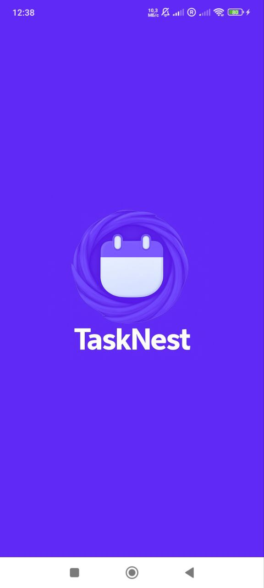
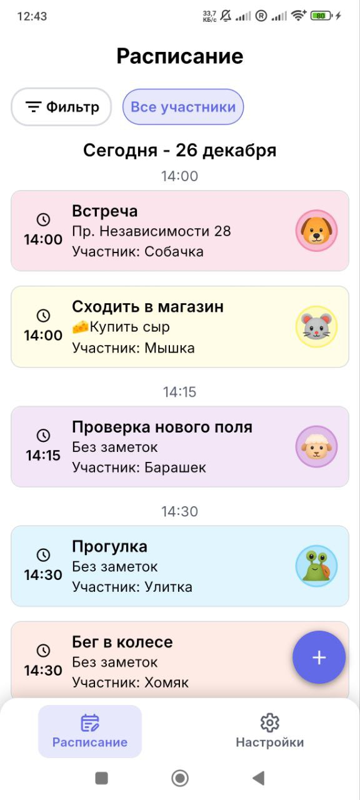
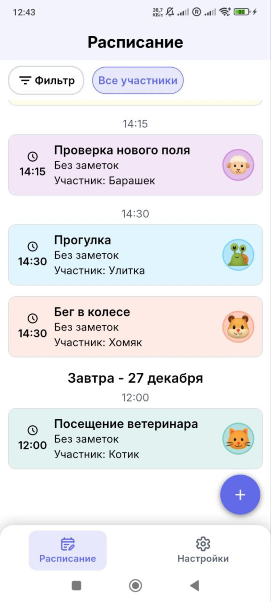
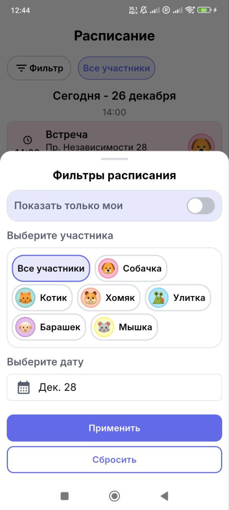
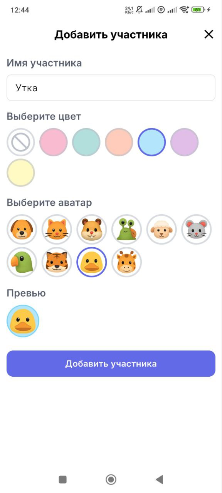
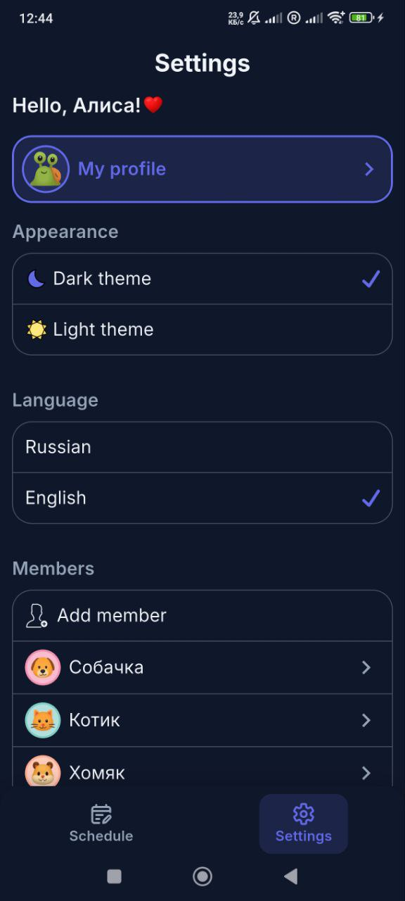

# TaskNest

TaskNest is a Flutter-based scheduling and event management app with:
- 👥 Member filtering
- 📅 Date filtering
- 🌐 Localization (English & Russian)
- 🌗 Light/Dark theme support
- 💾 Local data persistence with database (events and members are stored offline)

## 📱 Screenshots

| Splash | Empty Schedule | Settings (Light) |
|--------|----------------|------------------|
|  |  |  |

| Full Schedule 1 | Full Schedule 2 | Filters |
|------------------|------------------|---------|
|  |  |  |

| Add Event | Add Member | Settings (Dark) |
|-----------|------------|-----------------|
|  |  |  |

## ✨ Features

- Create and manage events with ease  
- Filter schedule by members
- Filter schedule by date  
- Light and dark theme support  
- Localized UI (English & Russian)  
- Clean architecture with BLoC (Cubit-based) state management & Drift as local database

